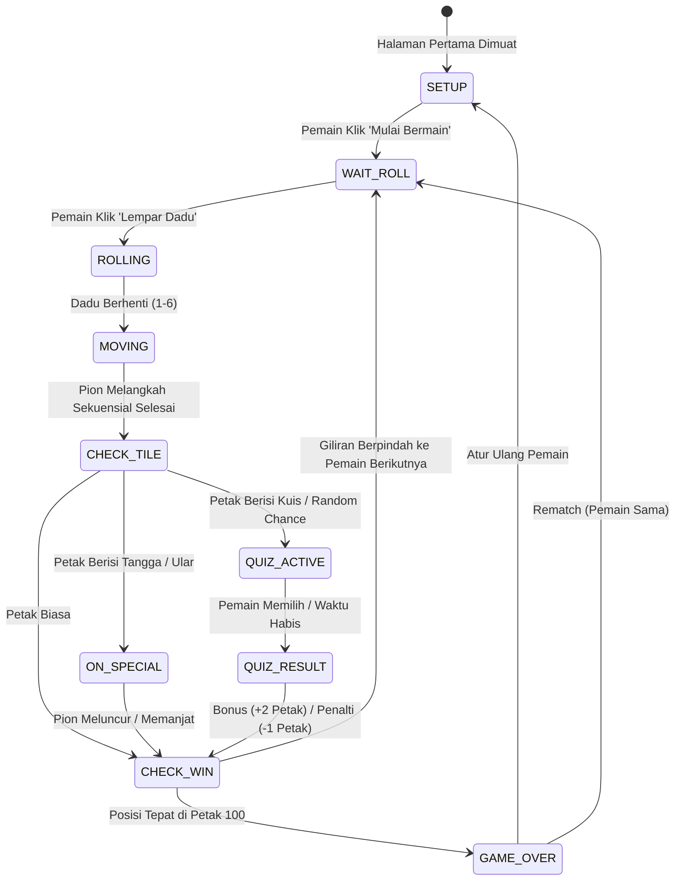

# AGENTS.md - Panduan Arsitektur & Standar Pengembangan Game Ular Tangga Trivia

Dokumen ini adalah referensi utama untuk AI agent dan developer yang memelihara, memperluas, atau mengembangkan fitur baru pada **Game Ular Tangga Trivia (Snakes & Ladders Quiz Edition)** berbasis **Next.js (App Router) + TypeScript**.

Proyek ini dirancang fullstack (All-in-One) sehingga dapat di-deploy secara instan ke **Vercel** tanpa memerlukan backend eksternal terpisah.

---

## 1. Ringkasan Proyek

- **Nama Game**: Ular Tangga Trivia (Snakes & Ladders Quiz Edition)
- **Teknologi**: Next.js 15 (App Router), React 19, TypeScript, Web Audio API
- **Mode Permainan**: Multiplayer Lokal Pass-and-Play (2 hingga 6 pemain)
- **Fitur Khas**:
  - Papan 100 kotak standar (10x10) dengan sistem zigzag.
  - Jalur ular dan tangga berbasis SVG dinamis.
  - Petak Kuis Acak (Trivia) dengan mekanisme Reward (+langkah) dan Penalty (-langkah).
  - Serverless Route Handler (`/api/quiz`) untuk pengambilan soal kuis.
  - Efek suara sintetis instan berbasis procedural Web Audio API tanpa file audio eksternal.
  - **Prinsip Visual**: *Strictly Flat / Neo-Brutalist Tactile Design* (**TANPA GRADASI / ZERO GRADIENTS**).

---

## 2. Aturan Mutlak Desain Visual (Design Directives)

> [!CAUTION]
> **ATURAN UTAMA 1: DILARANG MENGGUNAKAN GRADIEN (NO GRADIENTS)**
> 1. Tidak boleh ada sintaks `linear-gradient()`, `radial-gradient()`, `conic-gradient()`, atau `repeating-*-gradient()` di seluruh file CSS, Tailwind, maupun inline style.
> 2. Dilarang menggunakan efek mesh gradient, glowing gradient blur, atau gradient overlay pada latar belakang ataupun tombol.
> 3. Bayangan visual harus menggunakan **hard-offset solid shadow** (contoh: `box-shadow: 4px 4px 0px #18181B;` atau `2px 2px 0px #18181B`), bukan soft diffused shadow.
> 4. Warna harus 100% solid, kontras tinggi, dan memenuhi standar WCAG AA.
> 5. Border menggunakan garis tegas solid (contoh: `2px solid #18181B` atau `3px solid #18181B`).

> [!IMPORTANT]
> **ATURAN UTAMA 2: BATAS PANJANG FILE & WAJIB MODULAR (MAKSIMAL ~150 - 200 BARIS PER FILE)**
> 1. **DILARANG KERAS** membuat file tunggal raksasa (*God Component*) yang melebihi 250 baris.
> 2. Setiap fitur yang memiliki multiple view, tab, atau form **WAJIB dipecah** menjadi subkomponen mandiri di dalam subfolder khusus (contoh: `components/Admin/QuestionListView.tsx`, `CreateQuestionView.tsx`, `ImportExportView.tsx`).
> 3. Hindari penumpukan ratusan baris *inline styles* objek CSS. Manfaatkan kelas CSS terpusat di `globals.css` agar JSX tetap ringkas (< 150 baris).
> 4. Logika state yang kompleks harus diekstrak ke custom hooks atau utility function di `lib/` agar komponen utama mudah dipelihara (*clean and maintainable*).
> 5. **Pemisahan Halaman Admin**: Halaman game utama (`/`) strictly untuk pemain tanpa tombol/elemen admin. Seluruh pengelolaan bank soal dan kunci jawaban dipisahkan ke rute khusus **`/admin`** dengan autentikasi password.

### Palet Warna Utama (Solid Tokens)
- **Latar Belakang Dasar**: `#F4F4F6` (Off-white canvas bersih)
- **Border & Outline Utama**: `#18181B` (Ink Black pekat)
- **Aksen Primer / Action**: `#2563EB` (Cobalt Blue solid)
- **Aksen Kuis**: `#E11D48` (Rose Red solid)
- **Aksen Sukses / Tangga**: `#16A34A` / `#059669` (Emerald Green solid)
- **Aksen Peringatan / Ular**: `#DC2626` (Crimson solid)
- **Warna Pion Pemain (Solid Only)**:
  - Pemain 1: `#DC2626` (Crimson)
  - Pemain 2: `#2563EB` (Royal Blue)
  - Pemain 3: `#16A34A` (Forest Green)
  - Pemain 4: `#D97706` (Golden Amber)
  - Pemain 5: `#9333EA` (Deep Purple)
  - Pemain 6: `#0D9488` (Dark Teal)

---

## 3. Struktur Direktori Proyek

```
ular-tangga/
├── AGENTS.md                  # Panduan arsitektur & developer ini
├── pnpm-lock.yaml             # Lockfile pnpm (hemat disk & anti-ENOSPC)
├── package.json               # Dependensi Next.js & React & TypeScript
├── tsconfig.json              # Konfigurasi TypeScript modern
├── next.config.ts             # Konfigurasi Next.js
├── app/
│   ├── layout.tsx             # Root layout & Google Fonts
│   ├── page.tsx               # Orchestrator utama Game Engine (FSM React Hooks)
│   ├── globals.css            # Stylesheet solid flat tanpa gradien
│   ├── admin/
│   │   └── page.tsx           # Halaman khusus Admin Bank Soal (Terpisah dari Game)
│   └── api/
│       ├── admin/
│       │   └── login/route.ts # Serverless auth password admin
│       ├── quiz/
│       │   └── route.ts       # Serverless endpoint kuis acak
│       └── rooms/
│           ├── route.ts       # Endpoint POST: buat online room baru
│           └── [code]/
│               ├── route.ts   # Endpoint GET: ambil data room
│               ├── join/      # Endpoint POST: gabung room
│               ├── action/    # Endpoint POST: start, roll, quiz, rematch
│               └── sync/      # Endpoint GET: lightweight polling
├── components/
│   ├── Admin/                 # Subkomponen modular portal admin
│   │   ├── AdminLoginCard.tsx # Form login password admin
│   │   ├── QuestionListView.tsx # Filter & daftar soal trivia
│   │   ├── CreateQuestionView.tsx # Form penambahan soal kustom
│   │   └── ImportExportView.tsx # Backup & restore format JSON
│   ├── Board/
│   │   ├── Board.tsx          # Kontainer papan 10x10 & layer bidak
│   │   ├── Tile.tsx           # Komponen kotak petak individual
│   │   └── SnakesLaddersSVG.tsx # Jalur SVG ular dan tangga flat dinamis
│   ├── Game/
│   │   ├── Dice.tsx           # Dadu flat tactile dengan animasi kocok
│   │   ├── GameHeader.tsx     # Header permainan tanpa elemen admin
│   │   ├── TurnBanner.tsx     # Indikator giliran pemain aktif
│   │   ├── PlayerSidebar.tsx  # Panel daftar pemain, posisi & leaderboard
│   │   └── GameLog.tsx        # Riwayat pergerakan papan
│   ├── Modals/
│   │   ├── ModeSelectModal.tsx # Pilihan mode Main Lokal vs Online
│   │   ├── OnlineLobbyModal.tsx# Orchestrator modal lobby online
│   │   ├── OnlineLobby/       # Subkomponen modular lobby online
│   │   │   ├── ChoiceView.tsx # Pilihan buat / gabung
│   │   │   ├── CreateRoomView.tsx # Form host
│   │   │   ├── JoinRoomView.tsx   # Form gabung kode
│   │   │   └── WaitingLobbyView.tsx # Ruang tunggu pemain
│   │   ├── QuizModal.tsx      # Modal kuis interaktif dengan spectator mode
│   │   ├── SetupModal.tsx     # Pengaturan 2-6 pemain lokal
│   │   └── WinnerModal.tsx    # Modal kemenangan & statistik pertandingan
│   └── Audio/
│       └── SoundToggle.tsx    # Tombol toggle mute Web Audio API
└── lib/
    ├── types.ts               # Interface TypeScript
    ├── db.ts                  # Koneksi Neon DB serverless + singleton fallback
    ├── board-config.ts        # Matriks koordinat 1-100 zigzag, ular, tangga, petak kuis
    ├── quiz-bank.ts           # 50+ bank soal trivia bahasa Indonesia berbobot
    └── audio.ts               # Procedural sound engine (Web Audio API)
```

---

## 4. Arsitektur State Machine (Game Engine)

Game beroperasi menggunakan **Finite State Machine (FSM)** dalam `app/page.tsx` dengan state:



### Logika Petak 100 (Winning Condition)
- Pemenang harus mendarat **tepat di petak 100**.
- Jika lemparan melebihi 100, pion memantul mundur sisa langkahnya (contoh: Posisi 98, dadu 4 -> Maju ke 99, 100, lalu mundur ke 99, 98).

### Aturan Lemparan Dadu 6 (Bonus Roll / Jalan Lagi)
- **Hak Lempar Lagi**: Pemain yang melempar angka 6 berhak melempar dadu sekali lagi setelah pion selesai melangkah (dan setelah menyelesaikan tangga, ular, atau kuis jika ada).
- **Aturan 3x Berurutan**: Jika pemain melempar angka 6 sebanyak 3 kali berturut-turut, lemparan ketiga dibatalkan/hangus dan giliran langsung berpindah ke pemain berikutnya demi keadilan permainan.

### Reaksi Berantai Kuis (Chain Reactions)
- Jika bonus jawaban benar (+2 petak) mendaratkan pion di petak **Tangga**, pion akan langsung memanjat tangga tersebut.
- Jika penalti jawaban salah (-1 petak) menjatuhkan pion di petak **Kepala Ular**, pion akan meluncur turun ke ekor ular.


---

## 5. Koordinat Papan Zigzag (10x10)

Rumus konversi nomor petak ke koordinat grid:
- **Kotak 1**: Baris paling bawah, kolom paling kiri.
- **Kotak 10**: Baris paling bawah, kolom paling kanan (ke kanan).
- **Kotak 11**: Baris ke-2 dari bawah, kolom paling kanan (ke kiri).
- Pola zigzag berlanjut sampai **Kotak 100** di baris paling atas.

```typescript
export function getGridCoordinates(tileNumber: number): { row: number; col: number } {
  const index = Math.max(1, Math.min(100, tileNumber)) - 1;
  const rowFromBottom = Math.floor(index / 10);
  const row = 9 - rowFromBottom;
  const remainder = index % 10;
  const col = rowFromBottom % 2 === 0 ? remainder : 9 - remainder;
  return { row, col };
}
```

---

## 6. Deployment ke Vercel (All-in-One)

Proyek ini telah dikonfigurasi penuh untuk Vercel:
1. Push repositori ini ke GitHub / GitLab / Bitbucket.
2. Buka dashboard [Vercel](https://vercel.com) dan klik **"Add New Project"**.
3. Import repositori ini. Framework Preset otomatis terdeteksi sebagai **Next.js**.
4. Klik **"Deploy"**. Vercel akan menjalankan:
   ```bash
   npm run build
   ```
   dan secara otomatis menyiapkan serverless function untuk API route `/api/quiz` serta frontend statis berkecepatan tinggi.

---

## 7. Best Practices Bagi Developer & Agent

1. **Selalu Uji Bebas Gradien**:
   Setiap kali menambahkan styling baru, lakukan pencarian regex pada kata `gradient`. Nilai harus **0 match**.
2. **Animasi Berbasis Transform & Opacity**:
   Pion digerakkan menggunakan `transform` dan persentase absolut dengan transisi halus. Hindari manipulasi layout reflow berat.
3. **Pemisahan Logika & Tampilan**:
   Data statis diletakkan di `lib/`, antarmuka di `components/`, dan FSM di `app/page.tsx`.
4. **Strong Typing**:
   Gunakan interface yang didefinisikan dalam `lib/types.ts` untuk setiap objek state.
5. **Aksesibilitas (A11y)**:
   Semua tombol memiliki atribut `title` dan `aria-label`, serta kontras warna solid yang jelas terbaca.
